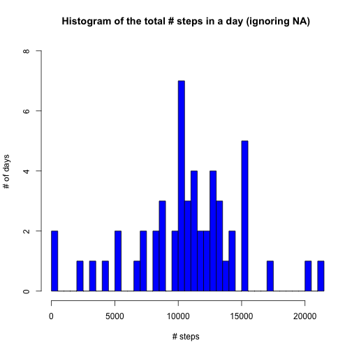
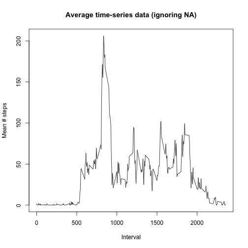
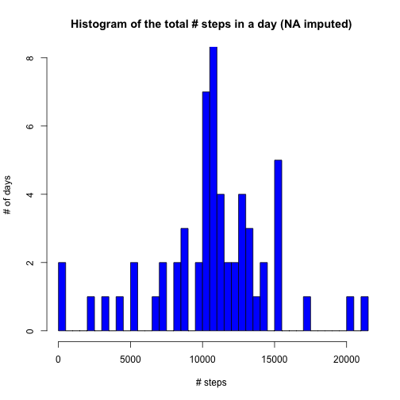
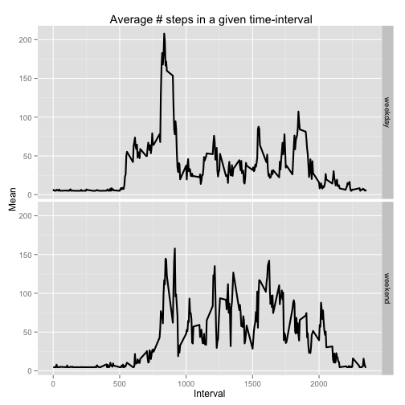

# Reproducible Research: Peer Assessment 1

In this report, we describe in detail the steps required to answer some of the questions through exploratory analysis of the activity monitoring data. The idea is to ensure complete reproducibility of the work we do in the process. Hence the focus would be on ensuring that all the steps are carried through using R commands (i.e., without any *manual* operations) and hence can be fully documented.

## Loading and preprocessing the data

The first step involves downloading the dataset from the remote location(of course, after setting the present working directory to the location on the local computer where we would like to store data). Once downloaded, the .zip files needs to be unzipped. The following lines achieve these objectives.


```r
download.file("https://d396qusza40orc.cloudfront.net/repdata%2Fdata%2Factivity.zip", "activity.zip", method="curl");
unzip("activity.zip");
```
The data is now contained in the unzipped file, i.e., *activity.csv*. We would like to load this into a dataframe, *req_data*, for further analysis.  

```r
req_data <- read.csv("activity.csv", header=FALSE, skip=1, na.strings="NA");
```
The first line (header) contains the names of the columns and hence was skipped from reading in the command above. We'd like to parse that line in order to give meaningful names to the columns of *req_data*. We do this using the following chunk of code.

```r
columnnames <- readLines("activity.csv", n=1); # Reads the first line
cnames <- strsplit(columnnames, ",", fixed=T); # Break it down into seperate column names using comma
names(req_data) <- make.names(cnames[[1]]); # Assign these names to the columns of req_data
```
In the analysis, it helps to have the dates in the dataset be represented in the R Date format. Hence we add a column, *myDate*, with dates represented as a Date object. This is done using the *X.date.* column in *req_data*.

```r
req_data$myDate <- as.Date(req_data$X.date.);
```
## What is mean total number of steps taken per day?

In this section, we would be working with the data stripped off of its NA values to find out the number of steps taken per day (i.e., summed over the entire day). This can be done using the following line - 


```r
req_data_withoutNA <- req_data[!is.na(req_data$X.steps.), ];
```
 Once we have *req_data_withoutNA*, the total number of the steps taken every day can be calculated by using *tapply* and summing with *myDate* as the factor variable.
 

```r
 sum_by_day_withoutNA <- tapply(req_data_withoutNA$X.steps., INDEX=factor(req_data_withoutNA$myDate), sum, simplify=TRUE);
```
We now plot a historgram of the sum we just calculated to examine the distribution of the total number of steps. Since the sum has a fairly wide distribution, we use 50 breaks in the histogram. The following chunk does this.


```r
hist(sum_by_day_withoutNA, breaks=50, xlab="# steps", ylab="# of days", xlim=c(min(sum_by_day_withoutNA), max(sum_by_day_withoutNA)), ylim=c(0, 8), main="Histogram of the total # steps in a day (ignoring NA)", col="blue");
```

 

We now calculate the mean and median of *sum_by_day_withoutNA* to answer the question we set out to, in the beginning of this section. 


```r
mean_sum_by_day_withoutNA <- mean(sum_by_day_withoutNA);
mean_sum_by_day_withoutNA
```

```
## [1] 10766
```

```r
median_sum_by_day_withoutNA <- median(sum_by_day_withoutNA);
median_sum_by_day_withoutNA
```

```
## [1] 10765
```

## What is the average daily activity pattern?

In this section, we are interested in understaning the activity pattern, averaged over all days for which the data was collected. Again, we'd be working with *req_data_withoutNA* to answer our questions.

The first step is to calculate the average number of steps taken during each 5-minute interval of the day the data was collected for. We do this by the use of *tapply* and averaging with *X.interval.* as the factor variable.


```r
mean_by_interval_withoutNA <- tapply(req_data_withoutNA$X.steps., INDEX=factor(req_data_withoutNA$X.interval.), mean, simplify=TRUE);
```

The calculated mean, *mean_by_interval_withoutNA*, is plotted as an *x-y* plot with solid line.  


```r
plot(as.integer(names(mean_by_interval_withoutNA)), mean_by_interval_withoutNA, type="l", xlab="Interval", ylab="Mean # steps", main="Average time-series data (ignoring NA)");
```

 

In order to determine the 5-minute interval that corresponds to maximum average activity, we use the *which.max()* function in R. The following lines do this.


```r
max_interval <- as.integer(names(which.max(mean_by_interval_withoutNA)));
max_interval
```

```
## [1] 835
```
## Imputing missing values

### Calculating the number and fraction of missing values

Before imputing missing values, we want to know how many values were missing i.e., had NA instead of valid number of steps. This gives us an idea of how much our conclusions drawn in the previous sections might be biased as opposed to the case when we had all the data within the same period.

We calculate both the number and the fraction of missing values in the following way.


```r
NACount_OriginalData <- sum(is.na(req_data$X.steps.));
NACount_OriginalData
```

```
## [1] 2304
```

```r
NAFraction_OriginalData <- NACount_OriginalData/nrow(req_data);
NAFraction_OriginalData
```

```
## [1] 0.1311
```

### Strategy for imputing missing values

One reasonable value to impute the NA values with is the average number of steps taken in a 5-minute interval, i.e., the sum of all the non-missing values in the entire dataset divided by the total number of non-missing values. It's easy to see that it can be calculated in the following manner.


```r
mean_steps <- mean(mean_by_interval_withoutNA);
mean_steps
```

```
## [1] 37.38
```

### New dataset with imputed values

We create a new data set containing the mean value we computed above in lieu of NA values in the original data set.


```r
data_withNAimputed <- req_data; # Copy to a new data frame
data_withNAimputed[is.na(data_withNAimputed)] <- mean_steps; # Impute NA with mean_steps
```

### Effect of imputing

In order to know how much of a bias we introduce with the specific choice of imputing strategy, it is instructive to recalculate the total number of steps in the day. We compute the sum as before, but with *data_withNAimputed* instead of *req_data_withoutNA*, and reconstruct the histogram.


```r
sum_by_day_NAimputed <- tapply(data_withNAimputed$X.steps., INDEX=factor(data_withNAimputed$myDate), sum, simplify=TRUE); # Compute sum

hist(sum_by_day_NAimputed, breaks=50, xlab="# steps", ylab="# of days", xlim=c(min(sum_by_day_NAimputed), max(sum_by_day_NAimputed)), ylim=c(0, 8), main="Histogram of the total # steps in a day (NA imputed)", col="blue");
```

 

We note that the distribution has changed only near the mean value i.e., *mean_sum_by_day_withoutNA*. This points to an interesting observation that **the missing values occur in chunks - when data is missing, it is so for *almost* the entire day**. The reasoning is that if the missing values were distributed uniformly across the entire data set, it would have altered/shifted all bins in the histogram. However, on the contrary, that it only affected bins near the mean value supports our above claim.

The mean should remain unaltered due to our choice of the value for imputing. We verify by computing the new mean and median.


```r
mean_sum_by_day_NAimputed <- mean(sum_by_day_NAimputed);
mean_sum_by_day_NAimputed
```

```
## [1] 10766
```

```r
median_sum_by_day_NAimputed <- median(sum_by_day_NAimputed);
median_sum_by_day_NAimputed
```

```
## [1] 10766
```

## Are there differences in activity patterns between weekdays and weekends?

We use the new dataset, *data_withNAimputed*, to answer the questions in this section. First we create a factor variable indicating whether it's a weekday or a weekend using the *weekdays()* function in R.


```r
data_withNAimputed$weekday_or_weekend <- factor(weekdays(data_withNAimputed$myDate) == "Saturday" | weekdays(data_withNAimputed$myDate) == "Sunday", labels=c("weekday", "weekend"));
```

Subsequently, we calculate the average activity in a 5-minute interval for weekdays and weekends separately. This is done by adding the factor we created above, *weekday_or_weekend*, to INDEX list of tapply.


```r
mean_by_interval_weekday_weekend <- tapply(data_withNAimputed$X.steps., INDEX=list(factor(data_withNAimputed$X.interval.), data_withNAimputed$weekday_or_weekend), mean, simplify=TRUE);
```

To create the panel plot comparing weekday and weekend activity patterns, we use the *ggplot2* library in R. The first step involves checking for its installation and installing if not already installed. Once installed, the library needs to be loaded as, in general, it is not loaded by default on starting RStudio.


```r
# Function for checking the installation of a given package
is.installed <- function(mypkg){
  is.element(mypkg, installed.packages()[,1])
}
# Checking if ggplot2 is already installed and installing if not done so already
if(!is.installed("ggplot2"))
  {
    install.packages("ggplot2");
  }
# Load ggplot2
library(ggplot2);
```

A dataframe needs to be created for plotting using *ggplot2*. The idea is to melt the data to plot and create axis and legend variables. The following piece of code accomplishes that.


```r
df_for_ggplot <- data.frame(MeanValue = c(mean_by_interval_weekday_weekend[, 1], mean_by_interval_weekday_weekend[, 2]), Axis1= rep(as.integer(row.names(mean_by_interval_weekday_weekend)), 2), Legend = c(rep(colnames(mean_by_interval_weekday_weekend)[1], nrow(mean_by_interval_weekday_weekend)), rep(colnames(mean_by_interval_weekday_weekend)[2], nrow(mean_by_interval_weekday_weekend))));
```

With *df_for_ggplot* created, the panel plot can be created in a straightforward fashion. First, we create the basic plot object in the manner described below.


```r
g <- ggplot(df_for_ggplot, aes(x= Axis1, y= MeanValue)) + geom_line(size=1) + facet_grid(Legend ~ .);
```

We then add some axis-labels and title and print it on screen.

```r
g <- g + xlab("Interval") + ylab(" Mean") + ggtitle(" Average # steps in a given time-interval");
g
```

 

We see that there are some interesting differences in the activity-patterns of weekdays and weekends. 

  1. The peak activity during weekday is higher than it is for weekend (early during the day). This might point to the fact that this peak corresponds to the activity around people's getting to work in the morning.
  
  2. After peak activity, the weekday activities die down while they do not for the case of weekend. This could mean that the subjects (a) hold a desk job that requires little activity during the day (sedentary lifestyle), and (b) during weekends, during the day, they do involve themselves with physical activity.
  
While not all correlation can be ascribed a causation, the observations point to some interesting hypotheses that could be proved or disproved.  
